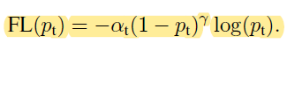

# Focal Loss for Dense Object Detection in PyTorch

## Focal Loss 식

[Focal Loss for Dense Object Detection](https://arxiv.org/pdf/1708.02002.pdf)

# Result
 Method             | training set | val set | mAP
---                 |---           |---      |---
 Cross Entropy Loss |VOC2007  | VOC2007 | 63.36
 Focal Loss         |VOC2007  | VOC2007 | 65.26
